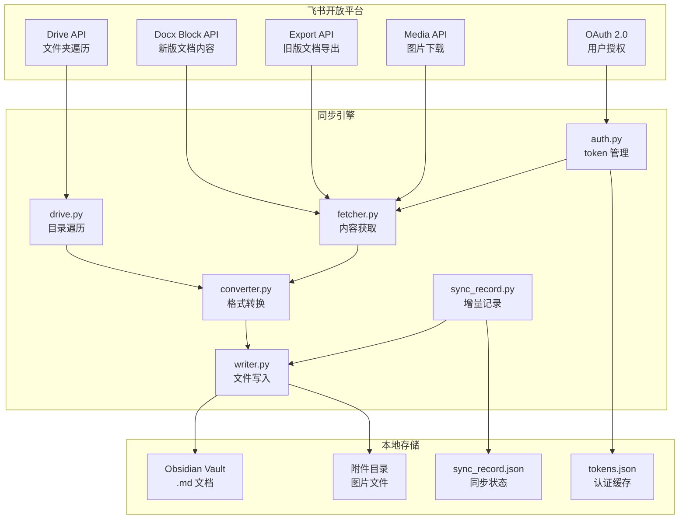
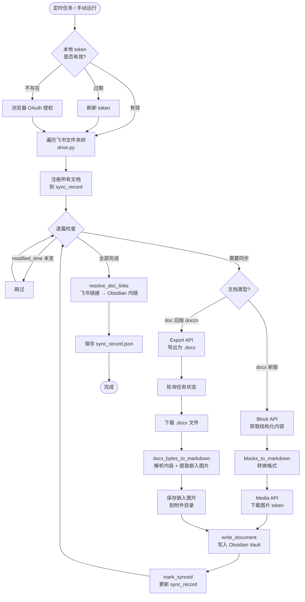

# feishu-obsidian-sync

将飞书个人文档库增量同步到本地 Obsidian Vault 的命令行工具。支持新版 `docx` 文档与旧版 `doc` 文档，自动下载图片、转换为 Markdown，并将飞书文档互引链接转为 Obsidian 内链。

---

## 功能特性

- **OAuth 2.0 授权**：浏览器一键授权，token 自动刷新，无需手动维护
- **全量 + 增量同步**：首次全量拉取，后续按 `modified_time` 跳过未修改文档
- **新旧文档双支持**：
  - 新版 `docx`（token 以字母开头）：通过 Block API 精确还原格式
  - 旧版 `doc`（token 以 `doccn` 开头）：通过 Export API 导出后解析
- **图片自动下载**：新版文档图片通过 Media API 下载；旧版文档图片从导出的 .docx 中提取，统一存入 `附件/文档名/` 目录
- **Obsidian 内链转换**：飞书文档互引链接自动转为 `[[文档名]]` 格式
- **结构保留**：飞书文件夹层级完整映射为本地目录结构
- **格式支持**：标题、加粗、斜体、删除线、行内代码、代码块、引用、待办、表格、分割线

---

## 系统架构



---

## 同步流程



---

## 使用前提

### 1. 飞书开放平台应用

在 [飞书开放平台](https://open.feishu.cn/) 创建自建应用，并配置以下内容：

**权限（人员信息/云文档）：**
- `docs:doc:readonly`
- `docx:document:readonly`
- `drive:drive:readonly`
- `drive:file:readonly`
- `drive:export:readonly`

**重定向 URL：**
```
http://localhost:8080/callback
```

### 2. 本地环境

- Python 3.11+
- Git

---

## 配置步骤

**1. 克隆项目**

```bash
git clone https://github.com/liwenmeng/feishu-obsidian-sync.git
cd feishu-obsidian-sync
```

**2. 安装依赖**

```bash
python -m venv venv
# Windows
venv\Scripts\pip install -r requirements.txt
# macOS / Linux
venv/bin/pip install -r requirements.txt
```

**3. 创建 `.env` 文件**

复制模板并填入你的配置：

```bash
cp .env.example .env
```

`.env` 各字段说明：

| 字段 | 说明 | 示例 |
|------|------|------|
| `FEISHU_APP_ID` | 飞书应用的 App ID | `cli_xxxxxxxxxx` |
| `FEISHU_APP_SECRET` | 飞书应用的 App Secret | `xxxxxxxxxxxxxxxx` |
| `FEISHU_ROOT_FOLDER_TOKEN` | 要同步的飞书文件夹 token，取自文件夹链接末段 | `fldcnxxxxxxxxxx` |
| `OBSIDIAN_VAULT` | 本地 Obsidian Vault 的绝对路径 | `D:\my-vault` 或 `/Users/xxx/vault` |

> **如何获取文件夹 token：** 在飞书网页端打开目标文件夹，URL 末段即为 token，例如 `https://your-company.feishu.cn/drive/folder/fldcnXXXXXX` 中的 `fldcnXXXXXX`。

---

## 如何运行

```bash
# Windows
venv\Scripts\python main.py

# macOS / Linux
venv/bin/python main.py
```

首次运行会自动打开浏览器进行飞书 OAuth 授权，授权完成后开始同步。后续运行直接增量同步，无需重新授权。

**Windows 定时任务（可选）：**

参考项目根目录的 `run_sync.bat`，配合 Windows 任务计划程序实现每日自动同步。

---

## 项目结构

```
feishu-obsidian-sync/
├── main.py            # 主入口，同步编排
├── auth.py            # OAuth 授权与 token 管理
├── config.py          # 配置加载（从 .env 读取）
├── drive.py           # 飞书文件夹遍历
├── fetcher.py         # 文档内容与图片获取、旧版文档导出
├── converter.py       # Block → Markdown 转换，.docx → Markdown 转换
├── writer.py          # Markdown 写入、图片保存、链接转换
├── sync_record.py     # 增量同步状态管理
├── http_client.py     # HTTP 会话封装
├── utils.py           # 工具函数
├── requirements.txt   # 依赖列表
├── .env.example       # 环境变量模板
└── run_sync.bat       # Windows 定时运行脚本
```

---

## License

MIT
